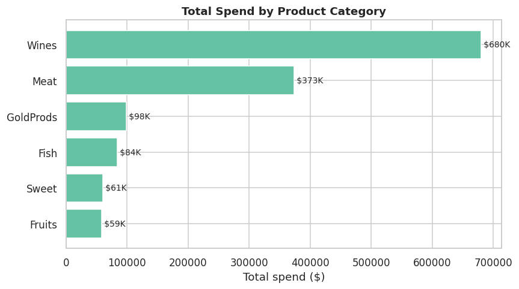
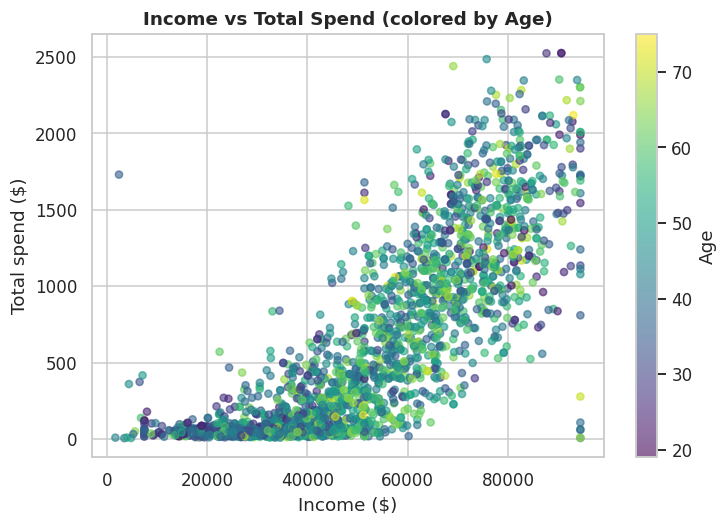
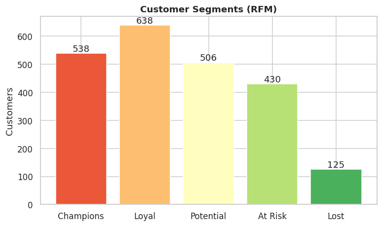
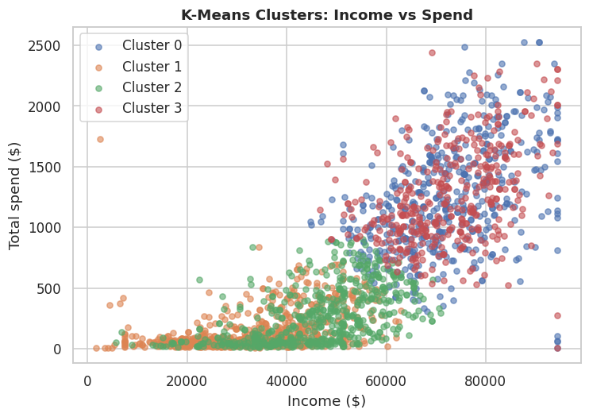
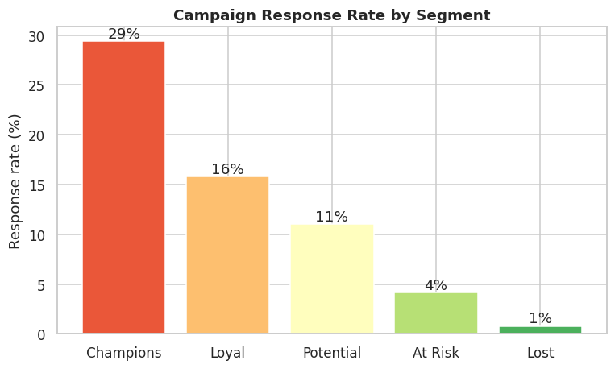
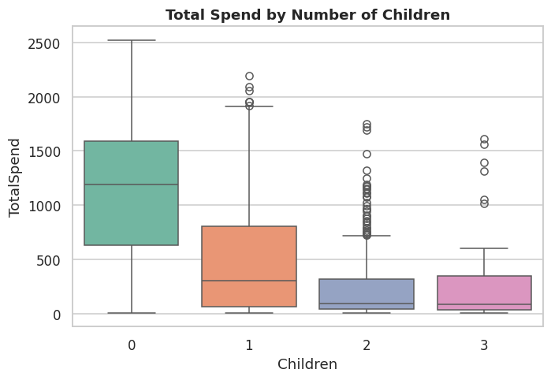

# 🛍️ Customer Personality Analysis — Segmentation & Campaign Targeting

> A senior-level customer analytics project: **RFM segmentation + K-Means clustering + campaign-response modeling + statistical testing** on 2,240 retail customers — to stop wasting marketing budget and target the customers who actually convert.

   

---

## 🚀 1. Project Overview

A retailer runs marketing campaigns, but only **14.9%** of customers respond — blasting everyone wastes budget. This project segments the customer base and identifies exactly **who to target and who to stop paying to reach.**

Workflow: **Cleaning → Feature Engineering → EDA → RFM Segmentation → K-Means Clustering → Campaign Response Analysis → Statistical Tests → Strategy.**

---

## 🎯 2. Business Objectives

1. Segment customers by value (RFM) and validate with unsupervised clustering (K-Means).
2. Quantify which segments drive revenue and which respond to campaigns.
3. Statistically test the drivers of campaign response and spend.
4. Convert findings into a concrete targeting and budget-allocation strategy.

---

## 📂 3. Dataset Information

| Item | Detail |
|------|--------|
| Source | Customer Personality Analysis / Marketing Campaign (Kaggle) |
| Rows | 2,240 customers |
| Columns | 29 |
| Content | Demographics, 2 years of spend across 6 categories, 5 past campaigns, channel usage |

---

## 🛠️ 4. Technologies Used

`Python 3` · `Pandas` · `NumPy` · `Matplotlib` · `Seaborn` · `SciPy` · `scikit-learn` (KMeans, StandardScaler) · `Jupyter`

---

## 🧹 5. Data Cleaning Process

Every decision is documented (not a blind `dropna()`):

1. **Income** — 24 missing → filled with **median** (robust to the `666,666` data-entry error).
2. **Income outliers** — capped at the 99th percentile.
3. **Age** — derived from `Year_Birth`; impossible ages (>100) removed.
4. **Marital_Status** — junk labels (`YOLO`, `Absurd`, `Alone`) consolidated.
5. **Constant columns** (`Z_CostContact`, `Z_Revenue`) dropped.

**Feature engineering:** `TotalSpend`, `TotalPurchases`, `Children`, `HasChildren`, `TotalAcceptedCmp`, `Tenure_days`.

---

## 📈 6. Exploratory Data Analysis

- **Wine is ~50% of all spending** — this is a wine-led business.
- Spend rises strongly with income (r = 0.81).
- Childless customers spend significantly more than those with children.

---

## 💡 7. Key Business Insights

| # | Finding | Number |
|---|---------|--------|
| 1 | Wine dominates spending | **~50%** of revenue |
| 2 | Champions drive the business | **24%** of customers → **49%** of revenue |
| 3 | Response is concentrated | Champions **29%** vs Lost **1%** |
| 4 | Income predicts value | r = **0.81** with spend |
| 5 | Children suppress spend | childless customers spend far more |
| 6 | Web traffic ≠ web sales | r = **-0.06** (conversion problem) |

### 🔬 Statistical Test Results

| Test | Comparison | Result |
|------|-----------|--------|
| T-Test | Income: responders vs not ($60K vs $50K) | p ≈ 1e-12 ✅ |
| T-Test | Spend: responders vs not ($987 vs $539) | p ≈ 3e-24 ✅ |
| ANOVA | Spend across education levels | F = 16.6, p ≈ 1e-10 ✅ |
| Chi-Square | Response vs having children | χ² = 93, p ≈ 5e-22 ✅ |
| Pearson | Income vs Spend | r = **0.81** ✅ |
| Pearson | Web visits vs web purchases | r = **-0.06** (friction signal) |

---

## 🧩 8. Segmentation Approach

**RFM** (rule-based) and **K-Means** (data-driven) were run independently and **agree** — a high-income / high-spend group that responds to campaigns, and low-value groups that don't. Two methods reaching the same conclusion makes the finding robust.

---

## 📊 9. Visualizations

| Spend by Category | Income vs Spend |
|---|---|
|  |  |

| RFM Segments | K-Means Clusters |
|---|---|
|  |  |

| Response by Segment | Spend by Children |
|---|---|
|  |  |

---

## 🧭 10. Business Recommendations

1. **Stop mass-blasting.** Target Champions + Loyal (16–29% response); exclude Lost/At-Risk (1–4%) to cut wasted spend.
2. **Build a wine-led loyalty program** — half of revenue; bundle other categories around it.
3. **Run a low-cost win-back** for "At Risk" before they become "Lost".
4. **Target childless, higher-income households** for premium campaigns; use a value message for families.
5. **Audit the website** — high visits + low purchases = conversion friction; cheaper to fix than buy more traffic.

---

## 📁 11. Project Structure

```
customer-personality-analysis/
├── data/marketing_campaign.csv
├── notebooks/customer_analysis.ipynb
├── images/*.png
├── analysis.py
├── requirements.txt
└── README.md
```

## ▶️ 12. How to Run

```bash
git clone https://github.com/memmedzadev81-max/customer-personality-analysis.git
cd customer-personality-analysis
pip install -r requirements.txt
python analysis.py
# or: jupyter notebook notebooks/customer_analysis.ipynb
```

## 👤 13. Author

**Vusal Mammadzade** — Data Analyst · GitHub: [memmedzadev81-max](https://github.com/memmedzadev81-max)
